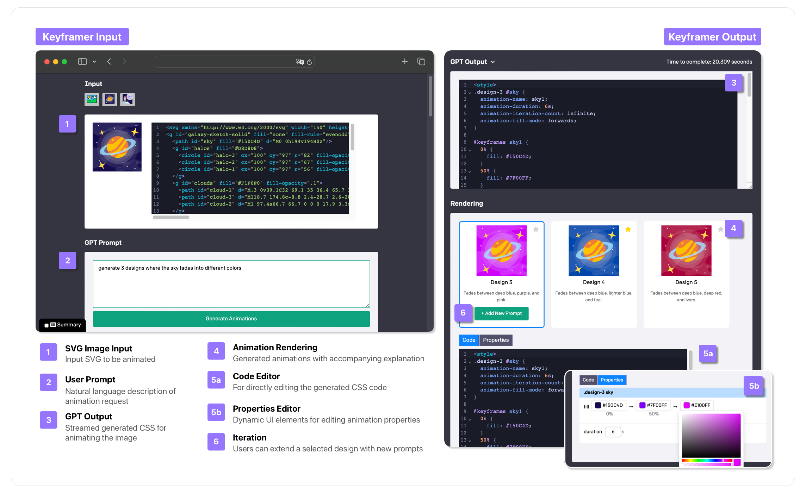
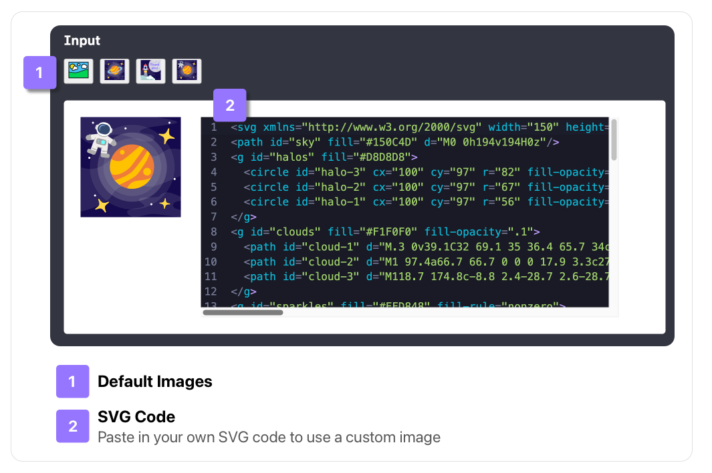
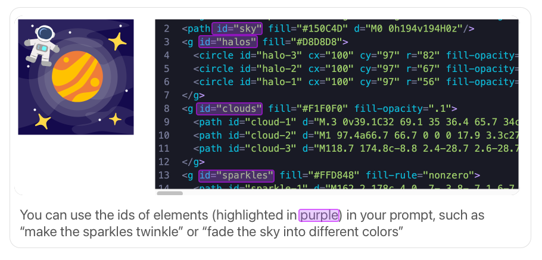

# Keyframer: Empowering Animation Design using Large Language Models

Keyframer is a design tool for animating static images using natural language prompts. It enables users to refine animations by directly editing generated designs and explore alternatives by requesting variants. [[Paper](https://arxiv.org/abs/2402.06071), [Video](https://machinelearning.apple.com/research/keyframer)]

Tiffany Tseng, Ruijia Cheng, Jeffrey Nichols



## Setup

This application utilizes GPT-4 and requires a valid Open AI API key. 

1. Clone this repository

2. Navigate to the project directory 
```bash
$ cd ml-keyframer
```
3. Install the requirements
```bash
$ npm install
```

4. Edit your bash profile to add your OpenAI API key.  

For example, on Mac, open your bash profile with the nano editor
```bash
$ nano ~/.bash_profile
```
or for newer Macs
```bash
$ nano ~/.zshrc
```

and add your Open AI API, replacing `your-api-key-here` with your API key
```bash
export OPENAI_API_KEY='your-api-key-here'
```

Save and exit (nano editor: Ctrl+O to write changes and Ctrl+X to close the editor)

Load your updated profile with
```bash
source ~/.bash_profile
```
or 
```bash
source ~/.zshrc
```

Verify your setup by typing `echo $OPENAI_API_KEY` in your terminal and check that it displays your API key.

If you are using Windows, you can find instructions for setting up your API key [here](https://platform.openai.com/docs/quickstart)

5. Run the app

```bash
$ npm run dev
```

You should now be able to access the app at [http://localhost:3000](http://localhost:3000)

## Using Keyframer

Keyframer takes SVG image input and uses GPT-4 to generate CSS code to animate the image.

1. Select one of the default images under `Input`, or paste in code for an SVG image in the Input field. (Please refer to the instructions below for preparing custom SVGs to use in Keyframer.)



2. Enter in a prompt for animating the image. When writing your prompt, it can helpful to incorporate the identifiers for elements in the SVG (specified with `id=ITEM_NAME` in the code, see figure below for more detail). You can request multiple designs to compare, e.g. `Create 3 animations of <user-request>`.



3. Click the "Generate Animations" button.

4. The LLM returns CSS code followed by the generated animation once the request is complete.

5. You can edit the response by 1) editing the CSS code using the Code Editors, or 2) editing the CSS properties using the Properties Editor. The Properties Editor will have some helpful UI for editing certain types of properties, such as a color picker for editing hex color values.

6. To extend your design, click "+ Add New Prompt" for any selected design to add a new prompt. Any new requests will be added on top of your existing design so you can iteratively build your animation.

## Preparing Custom SVG Images
Keyframer takes image input in the form of an SVG. You can create your own SVG images in your graphics editor of choice before bringing it into Keyframer.

When creating custom images, it's important to add relevant names to your layers so the large language model has context of the elements in the image. When you name your layers, those names will be exported in the SVG code as `id` properties on the different SVG elements. 

For step by step tips for preparing SVGs to use in Keyframer (including naming and grouping layers and minimizing the SVG size), please refer to Section A.2 in the [paper](https://arxiv.org/abs/2402.06071).

## BibTeX

To cite our paper, please use

```bibtex
@article{tseng2024keyframer,
  title={Keyframer: Empowering Animation Design using Large Language Models},
  author={Tseng, Tiffany and Cheng, Ruijia and Nichols, Jeffrey},
  journal={arXiv preprint arXiv:2402.06071},
  year={2024}
}
```

## Acknowledgments
* This application builds upon the [Open AI Quickstart Tutorial](https://github.com/openai/openai-quickstart-node)
